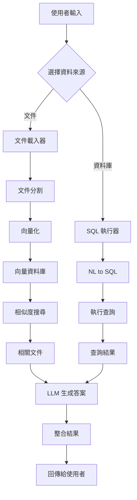

# RAG 全功能系統架構

## 系統概述

本系統是一個企業級的 RAG (Retrieval-Augmented Generation) 問答系統，支援多種資料來源、多種 LLM 模型和向量資料庫。

## 專案結構

```
rag-system/
├── 📋 README.md                    # 專案說明文件
├── 📋 ARCHITECTURE.md              # 系統架構文件（本文件）
├── 🔧 .env.example                 # 環境變數範例
├── 🔒 .gitignore                   # Git 忽略設定
├── 🐳 docker-compose.yml           # Docker Compose 配置
├── 🐳 Dockerfile                   # Docker 映像配置
├── 📦 requirements.txt             # Python 套件依賴
├── 🗄️ init.sql                     # 資料庫初始化腳本
│
├── 🖥️ app.py                       # Streamlit 主程式（Web UI）
├── ⚙️ main.py                       # 命令列介面
├── 🔗 rag_chain.py                 # RAG 核心邏輯
│
├── 📁 config/                      # 配置管理
│   ├── __init__.py
│   └── settings.py                 # 全域設定管理
│
├── 📁 llm/                         # LLM 模型管理
│   ├── __init__.py
│   └── provider_selector.py        # LLM 提供者選擇器
│       ├── OpenAI GPT 支援
│       ├── Anthropic Claude 支援
│       └── Ollama 本地模型支援
│
├── 📁 loader/                      # 文件載入器
│   ├── __init__.py
│   └── doc_parser.py               # 文件解析器
│       ├── PDF 載入器
│       ├── Word 載入器
│       ├── Excel 載入器
│       ├── Markdown 載入器
│       ├── HTML 載入器
│       └── JSON 載入器
│
├── 📁 vectorstore/                 # 向量資料庫管理
│   ├── __init__.py
│   └── index_manager.py            # 向量索引管理器
│       ├── Chroma 支援
│       ├── Redis 支援
│       └── Qdrant 支援
│
├── 📁 db/                          # SQL 資料庫相關
│   ├── __init__.py
│   └── sql_executor.py             # SQL 查詢執行器
│       ├── 自然語言轉 SQL
│       ├── PostgreSQL 支援
│       └── MySQL 支援
│
├── 📁 utils/                       # 工具函數
│   ├── __init__.py
│   ├── highlighter.py              # 文字高亮工具
│   └── logger.py                   # 日誌管理器
│
├── 📁 ui/                          # 使用者介面
│   ├── __init__.py
│   └── streamlit_ui.py             # Streamlit UI 元件
│
├── 📁 docs/                        # 文件資料夾
│   ├── knowledge.txt               # 文字知識檔
│   ├── knowledge.pdf               # PDF 知識檔
│   ├── knowledge.md                # Markdown 知識檔
│   ├── knowledge.html              # HTML 知識檔
│   ├── knowledge.json              # JSON 知識檔
│   └── knowledge.sql               # SQL 查詢範例
│
├── 📁 vector_db/                   # 向量資料庫存儲
│   └── chroma/                     # Chroma 持久化資料
│
├── 📁 uploads/                     # 使用者上傳檔案
│
├── 📁 logs/                        # 系統日誌
│   └── app.log                     # 應用程式日誌
│
└── 📁 tests/                       # 測試檔案
    ├── __init__.py
    ├── test_llm.py                 # LLM 測試
    ├── test_loader.py              # 載入器測試
    ├── test_vectorstore.py         # 向量資料庫測試
    └── test_db.py                  # SQL 資料庫測試
```

## 核心模組說明

### 1. **主程式模組**

#### `app.py` - Web 應用程式入口
- Streamlit 網頁介面
- 檔案上傳處理
- 查詢請求路由
- 結果展示

#### `main.py` - CLI 入口
- 命令列介面
- 快速測試工具
- 批次處理支援

#### `rag_chain.py` - RAG 核心引擎
- 整合所有模組
- 查詢流程控制
- 結果聚合處理

### 2. **LLM 模組** (`llm/`)

```python
# provider_selector.py 結構
def get_llm(provider=None):
    """
    根據設定選擇 LLM 提供者
    支援：OpenAI、Claude、Ollama
    """
```

### 3. **文件處理模組** (`loader/`)

```python
# doc_parser.py 功能
- load_and_split_documents()  # 載入並分割文件
- 支援格式：PDF, DOCX, XLSX, MD, HTML, JSON
- 使用 RecursiveCharacterTextSplitter 分割
```

### 4. **向量資料庫模組** (`vectorstore/`)

```python
# index_manager.py 功能
- get_vectorstore()      # 獲取向量資料庫實例
- get_embeddings()       # 獲取嵌入模型
- 支援：Chroma、Redis、Qdrant
```

### 5. **資料庫查詢模組** (`db/`)

```python
# sql_executor.py 功能
- query_database()       # 執行資料庫查詢
- nl_to_sql()           # 自然語言轉 SQL
- execute_sql()         # 執行 SQL 語句
```

## 資料流程圖



## 技術架構

### 前端
- **框架**: Streamlit
- **功能**: 檔案上傳、即時查詢、結果展示

### 後端
- **語言**: Python 3.12
- **框架**: LangChain
- **非同步**: asyncio

### 資料儲存
- **向量資料庫**: Chroma / Redis / Qdrant
- **關聯式資料庫**: PostgreSQL / MySQL
- **檔案儲存**: 本地檔案系統

### 容器化
- **容器**: Docker
- **編排**: Docker Compose
- **基礎映像**: python:3.12-slim

## 部署架構

```
┌─────────────────┐
│   Nginx/Proxy   │
└────────┬────────┘
         │
┌────────▼────────┐
│  Streamlit App  │
│    (Port 8501)  │
└────────┬────────┘
         │
    ┌────┴────┬─────────┬──────────┐
    │         │         │          │
┌───▼───┐ ┌──▼───┐ ┌──▼───┐ ┌────▼────┐
│Chroma │ │Redis │ │Qdrant│ │PostgreSQL│
└───────┘ └──────┘ └──────┘ └─────────┘
```

## 設定管理

### 環境變數分類

1. **LLM 設定**
   - `LLM_PROVIDER`: 選擇 LLM 提供者
   - `*_API_KEY`: 各提供者的 API 金鑰

2. **向量資料庫設定**
   - `VECTOR_DB`: 選擇向量資料庫
   - `EMBED_PROVIDER`: 嵌入模型提供者

3. **SQL 資料庫設定**
   - `DB_TYPE`: 資料庫類型
   - `DB_*`: 連接參數

4. **應用程式設定**
   - `LOG_LEVEL`: 日誌級別
   - `CHUNK_SIZE`: 文件分割大小

## 擴展點

### 1. 新增 LLM 提供者
在 `llm/provider_selector.py` 中新增：
```python
elif provider == "new_provider":
    return NewProviderLLM(...)
```

### 2. 新增文件格式
在 `loader/doc_parser.py` 中新增：
```python
elif ext == ".new":
    loader = NewFormatLoader(path)
```

### 3. 新增向量資料庫
在 `vectorstore/index_manager.py` 中新增：
```python
elif vec_type == "new_db":
    return NewVectorDB(...)
```

## 安全考量

1. **API 金鑰保護**
   - 使用環境變數
   - 不提交 `.env` 檔案
   - 定期輪換金鑰

2. **SQL 注入防護**
   - 參數化查詢
   - 輸入驗證
   - 危險操作過濾

3. **檔案上傳安全**
   - 檔案類型檢查
   - 大小限制
   - 病毒掃描（建議）

4. **容器安全**
   - 非 root 用戶運行
   - 最小權限原則
   - 定期更新基礎映像

## 監控與日誌

### 日誌架構
```
logs/
├── app.log          # 應用程式日誌
├── access.log       # 訪問日誌
└── error.log        # 錯誤日誌
```

### 監控指標
- 查詢響應時間
- LLM API 調用次數
- 向量資料庫查詢效能
- 系統資源使用率

## 效能優化

1. **快取策略**
   - Redis 查詢快取
   - 嵌入向量快取
   - LLM 回應快取

2. **批次處理**
   - 文件批次載入
   - 向量批次計算
   - 資料庫批次查詢

3. **非同步處理**
   - 非同步 LLM 調用
   - 非同步檔案處理
   - 非同步資料庫查詢

## 維護指南

### 日常維護
1. 檢查日誌檔案
2. 監控資源使用
3. 清理暫存檔案
4. 更新向量索引

### 定期維護
1. 備份向量資料庫
2. 優化資料庫索引
3. 更新依賴套件
4. 安全漏洞掃描

### 故障處理
1. 檢查服務狀態
2. 查看錯誤日誌
3. 驗證 API 連接
4. 重啟問題服務

## 開發規範

### 程式碼風格
- 遵循 PEP 8
- 使用 Type Hints
- 編寫 Docstrings
- 單元測試覆蓋

### Git 工作流程
- Feature Branch
- Code Review
- CI/CD Pipeline
- 語義化版本

### 文檔要求
- API 文檔
- 使用範例
- 配置說明
- 更新日誌