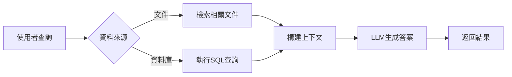

# 🧠 RAG 全功能系統架構總覽

## 📋 系統概述

RAG（Retrieval-Augmented Generation）系統是一個企業級的智慧問答平台，整合了文件檢索、資料庫查詢和 AI 生成功能。

## 🏗️ 核心架構

### 1. **應用層** 
- **Web UI** (`app.py`) - Streamlit 網頁介面
- **CLI** (`main.py`) - 命令列介面

### 2. **核心引擎** 
- **RAG Chain** (`rag_chain.py`) - 協調所有模組的中央處理器
- **Config** (`config/`) - 統一配置管理

### 3. **智慧處理模組**

#### 📄 文件處理管道
```
上傳文件 → 解析 → 分割 → 向量化 → 儲存 → 檢索 → 生成答案
```
- **支援格式**：PDF, Word, Excel, Markdown, HTML, JSON, TXT
- **處理流程**：
  - 文件解析 (`loader/doc_parser.py`)
  - 文字分割 (chunk_size=1000, overlap=100)
  - 向量嵌入 (OpenAI/HuggingFace)
  - 相似度搜尋

#### 🗄️ 資料庫查詢管道
```
自然語言 → SQL轉換 → 查詢執行 → 結果格式化 → 生成答案
```
- **支援資料庫**：PostgreSQL, MySQL
- **安全機制**：SQL 注入防護
- **智慧轉換**：自然語言轉 SQL

### 4. **AI 模型層**

#### 🤖 語言模型 (LLM)
- **免費選項**：
  - Ollama (本地運行)
    - Llama3 (建議)
    - Mistral
    - Gemma
- **付費選項**：
  - OpenAI (GPT-3.5/GPT-4)
  - Anthropic (Claude)

#### 🔤 嵌入模型
- **免費選項**：HuggingFace (all-MiniLM-L6-v2)
- **付費選項**：OpenAI Embeddings

### 5. **資料儲存層**

#### 向量資料庫
- **Chroma** - 本地持久化（預設）
- **Redis** - 分散式快取
- **Qdrant** - 雲端擴展

#### 關聯式資料庫
- **PostgreSQL** - 主要選項
- **MySQL** - 替代方案

## 🌟 系統特色

### 1. **模組化設計**
- 每個組件都可獨立替換
- 支援多種 LLM 和向量資料庫
- 易於擴展新功能

### 2. **成本優化**
- 預設使用免費服務（Ollama + HuggingFace）
- 可選付費服務以提升效能
- 本地處理選項保護隱私

### 3. **企業級功能**
- 多格式文件支援
- SQL 資料庫整合
- 批次處理能力
- 完整的錯誤處理和日誌

### 4. **部署靈活性**
- Docker 容器化部署
- 本地 Python 環境
- 雲端擴展支援

## 📊 資料流程



## 🚀 快速開始

### 免費模式（推薦）
```bash
# 1. 安裝 Ollama
curl -fsSL https://ollama.com/install.sh | sh

# 2. 啟動系統
./start_ollama.sh
streamlit run app.py
```

### Docker 部署
```bash
docker-compose up -d
```

## 📁 目錄結構

```
rag-system/
├── 🎯 app.py              # Web UI 入口
├── 💻 main.py             # CLI 入口
├── 🧠 rag_chain.py        # 核心引擎
├── ⚙️  config/            # 配置管理
├── 🤖 llm/               # LLM 模組
├── 📄 loader/            # 文件載入器
├── 🔍 vectorstore/       # 向量資料庫
├── 🗄️  db/               # SQL 資料庫
├── 🛠️  utils/            # 工具函數
└── 🧪 tests/            # 測試套件
```

## 💡 使用建議

1. **開發測試**：使用 Ollama + Chroma
2. **生產環境**：考慮 OpenAI + Redis/Qdrant
3. **資源受限**：使用 gemma:2b 模型
4. **高品質需求**：使用 GPT-4 或 Claude

## 🔧 擴展點

- 新增文件格式：在 `loader/doc_parser.py` 添加
- 新增 LLM：在 `llm/provider_selector.py` 添加
- 新增向量 DB：在 `vectorstore/index_manager.py` 添加
- 客製化 UI：修改 `app.py` 或創建新介面

---

這個系統設計靈活、功能完整，既可以完全免費運行，也能根據需求升級到商業服務。